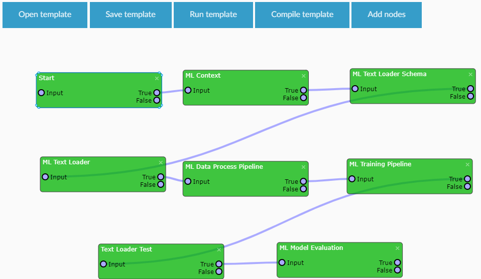
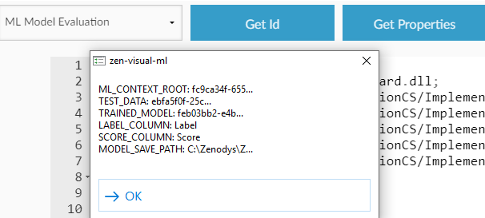

# VisualML Studio

VisualML Studio is visual workflow designer for Microsoft's ML.NET library that runs on premises.
It simplifies ML training and processing.</br>
One of the strong points are the foundations for simple models and project exchange.</br>
It’s also easily extendable with C# code.
VisualML Studio is part of Zenodys open source microservice orchestration stack.

# Table of contents

- [Installation](#installation)
- [Taxi Fares prediction example](#taxi-fares-prediction-example)
- [Extending Taxi Fares prediction example](#extending-taxi-fares-prediction-example)
- [Extending Taxi Fares prediction example](#extending-taxi-fares-prediction-example)
- [Create and evaluate model](#create-and-evaluate-model)
- [CS and Python are not enemies](#cs-and-python-are-not-enemies)
- [Roadmap](#roadmap)

# Installation
Download and extract prebuilt binaries from [releases page](https://github.com/Zenodys/ZenDevTool/releases). Check the latest release and under Assets section find binaries for your OS (visual-ml-studio_*)</br>

This bundle contains:</br>
* <b>VisualML Studio</b> that allows you create and train models visually
* <b>Computing Engine</b> that executes script created in VisualML Studio
* <b>NetCore runtime</b> that is hosted from this bundle so you don't have to have it installed on your computer.

Now you’ll download <b>Taxi Fare Prediction visual script (template)</b> so that you don’t have to build it from the scratch. You will just have to adopt a few properties to your environment (path to files).</br>
Navigate to Visual Templates [releases page](https://github.com/Zenodys/ZenTemplates/releases). Under <b>Assets</b> section of latest release you'll find <b>visual_scripts.zip</b> file. Download and extract it.</br>
This bundle contains:
* <b>TaxiFarePrediction.json</b>: this is visual script that we'll need in the first example for predicting taxi fare prices
* <b>TaxiFarePredictionCS.json</b>: visual script that we'll need in the second example
* <b>taxi_fare_prediction_assets</b> folder where training and testing data are stored 

This is an open source project from following repositories:</br>
* VisualML Studio
* [Computing engine](https://github.com/Zenodys/ZenUnmanaged) that executes scripts created in visual development tool
* [Elements](https://github.com/Zenodys/ZenDotNet/tree/develop/Elements/NetCore), visual wrappers around ML .NET object model
* Pre-created [Visual Templates](https://github.com/Zenodys/ZenTemplates)

# Taxi Fares prediction example

This example is based on Taxi Fares predictions. You can read more on [ML NET Samples github repository](https://github.com/dotnet/machinelearning-samples/tree/master/samples/csharp/getting-started/Regression_TaxiFarePrediction).

Problem description is taken from the official GitHub repository:
“This problem is centered around predicting the fare of a taxi trip in New York City. At first glance, it may seem to depend simply on the distance traveled. However, taxi vendors in New York charge varying amounts for other factors such as additional passengers, paying with a credit card instead of cash and so on. This prediction can be used in application for taxi providers to give users and drivers an estimate on ride fares.”</br>

We are going to train and build a model that takes some inputs (trip time, passenger count...) and predict fare of the ride. In this example regression algorithm is used, because those kinds of algorithms are used to predict some continuous value for given parameters.

After you download prebuilt binaries, start VisualML Studio by clicking on <b>visual-ml-studio</b> executable file.
Click <b>Open template</b> button inside visual designer and select <b>TaxiFarePrediction.json</b> template that is placed in <b>visual_scripts</b> folder that you extracted in previous step.</br>

Before going into details, let’s just briefly explain the process of training and evaluating the model:</br>


* The first element is <b>Start</b> and represents an entry point for template execution
* The second element is <b>ML Context</b>. This is the starting point for training, prediction, model operations and serves as a catalog of available operations. <b>ML Context</b> is needed for all your pipelines 
* Next one is  <b>ML Text Loader Schema</b>. We are going to read data from CSV files and here we are defining data structure (giving names to the columns)
* After schema is defined, <b>ML Text Loader</b> reads data from CSV file.
* <b>ML Data Processing Pipeline</b> is set of data transformation algorithms needed to train model.
* <b>ML Training Pipeline</b> is set of training operations. Here is also defined which training algorithm is going to be used to predict Taxi Fares.
* <b>Test Loader Test</b> reads test data for evaluating trained model
* <b>ML Model Evaluation</b> executes evaluation on trained model and prints result (metrics)
</br>

Let's look closer at each of element. </br>

<b>ML Text Loader Schema</b></br></br>
When you click on <b>ML Text Loader Schema element</b>, you’ll see Define schema button. This will open following view:</br></br>
</br></br>
Those are column definitions from <b>taxi-fare-train.csv</b> file (you will need to set path to the file later). Here you can see columns and data types that will be used in data processing pipelines.</br></br>

 <b>ML Text Loader  (requires manual input)</b></br></br>
 This element reads data from files. Here you must select the path to <b>taxi-fare-train.csv</b> file on your computer. CSV file is part of the <b>visual_sripts</b> bundle you can find in <b>taxi_fare_prediction_assets</b>  directory</br></br>

 <b>ML Data Process Pipeline</b></br></br>
 This is one of the most powerful ML elements that defines the data transformation pipeline required by training process. By clicking on the <b>Define data workflow</b> button, you’ll get the following pipeline:<br/><br/>
 </br></br>

* First data processing pipeline operation is <b>DPCopyColumns</b> which copies the FareAmount column to a new column called Label. This Label column holds the actual taxi fare that the model has to predict.
* Next three elements are one hot encodings that perform operations on those three columns which contains enumerative data: <b>VendorId, RateCode, and PaymentType</b>. </br>
This is a required step because machine learning models cannot handle enumerative data directly. Those are text fields and this transformation apply to them. You can read about <b>one hot encoding</b> [here](https://hackernoon.com/what-is-one-hot-encoding-why-and-when-do-you-have-to-use-it-e3c6186d008f)  
* Next three elements (<b>PassengerCount, TripTime and TripDistance</b>) are <b>normalize mean variance</b> transformers that calculates the mean and variance of the training data during the training model process. Those data are in numeric form but we don’t want to take them raw, so we apply normalization method against those columns to improve prediction results. Other normalization methods could be <b>Normalize Log Mean Variance, Normalize Lp Norm, Normalize Min Max</b> to name a few
* Last one is <b>Concatenate</b> operation which combines all input data columns into a single column called Features (ML.NET trains on a single input column). This provides a mechanism to build an aggregate field (Features)</br></br>
Now you can close this view to return to the main workflow.</br></br>

<b>ML Training Pipeline</b></br></br>
This is the step where you define training algorithm, Feature and Label columns.</br></br>

<b>Text Loader Test  (requires manual input)</b></br></br>
At this point, the model is built. All that’s needed to do is to validate it. This element loads training data. Select path to the <b>taxi-fare-test.csv</b> on your computer (same path that you applied already to taxi-fare-train.csv).</br></br>

<b>ML Model Evaluation (requires manual input)</b></br></br>
This is a model evaluation step. Enter the location where trained model will be saved. This will create a zip file with all needed information about training process.</br>

You can pass the training model around and used elsewhere just by loading it from a file.</br>
Part of the VisualML Platform will be a standardized model sharing (training models marketplace) that will offer simple exchange and use of pre-trained models inside the Visual ML Studio.</br>


Now you can click on the <b>Save template</b> button to save changed paths.</br></br>

# Create and evaluate model
To start template executions, click on <b>Run template</b> button.</br>

This will give you the following output:<br/><br/>
<br/><br/>

Evaluation process prints following metrics for regression:<br/>
* <b>Rms</b>: Coefficient of determination represents the predictive power of the model as a value between -inf and 1.00. 1.00 means there is a perfect fit, and the fit can be arbitrarily poor so the scores can be negative. A score of 0.00 means the model is guessing the expected value for the label. R2 measures how close the actual test data values are to the predicted values. The closer to 1.00, the better quality. However, sometimes low R-squared values (such as 0.50) can be entirely normal or good enough for your scenario and high R-squared values are not always good and be suspicious.

* <b>Absolute loss</b>: measures how close the predictions are to the actual outcomes. It is the average of all the model errors, where model error is the absolute distance between the predicted label value and the correct label value. This prediction error is calculated for each record of the test data set. Finally, the mean value is calculated for all recorded absolute errors.
The closer to 0.00, the better quality. Note that the mean absolute error uses the same scale as the data being measured (is not normalized to specific range). Absolute-loss, Squared-loss, and RMS-loss can only be used to make comparisons between models for the same dataset or dataset with a similar label value distribution.
* <b>Squared Loss</b>: tells you how close a regression line is to a set of test data values. It does this by taking the distances from the points to the regression line (these distances are the errors E) and squaring them. The squaring gives more weight to larger differences.
It is always non-negative, and values closer to 0.00 are better. Depending on your data, it may be impossible to get a very small value for the mean squared error.

* <b>RMS loss</b>: measures the difference between values predicted by a model and the values actually observed from the environment that is being modeled. RMS-loss is the square root of Squared-loss and has the same units as the label, similar to the absolute-loss though giving more weight to larger differences. Root mean square error is commonly used in climatology, forecasting, and regression analysis to verify experimental results.
It is always non-negative, and values closer to 0.00 are better. RMSD is a measure of accuracy, to compare forecasting errors of different models for a particular dataset and not between datasets, as it is scale-dependent.

So, if everything went well, you’ll be able to predict taxi fare prices next time you’ll be in New York :)<br/><br/>

# Extending Taxi Fares prediction example

In the first example basic predictions of taxi fares were demonstrated. But there are few limitations according to the original [ML.NET github example](https://github.com/dotnet/machinelearning-samples/tree/master/samples/csharp/getting-started/Regression_TaxiFarePrediction/TaxiFarePrediction/TaxiFarePredictionConsoleApp):
* Visual Element that filters noise from data doesn’t exist yet at the time of writing this example.
* We couldn’t test single prediction, because this part requires two custom C# objects, <b>TaxiTrip</b> and <b>TaxiTripFarePrediction</b>:</br>
```var predEngine = mlContext.Model.CreatePredictionEngine<TaxiTrip, TaxiTripFarePrediction>(trainedModel);```</br>

Let's overcome those kind of limitations.</br>
VisualML Studio allows you to write custom C# scripts right into Visual Element. This is the strongest VisualML Studio feature that allows you unlimited flexibility in interaction of your custom code with existing Visual Elements.</br>
In your custom scripts, you can:
* get results from Visual Elements
* set Visual Elements results
* get property values from Visual Elements
* set properties of Visual Elements
* execute Visual Elements without being physically connected with virtual wires. That means that script elements can at runtime make decision which path of workflow to choose, based on some conditions</br>

… and much more. All that without even leaving VisualML Studio.</br></br>
<b>Load extended template</b></br></br>

Open the <b>TaxiFarePredictionCS.json</b> Template and set paths according to your environment (you already did this in the previous example, but now we loaded new Template):</br>
* Click on <b>ML Text Loader</b> element. Select the path to <b>taxi-fare-train.csv</b> file
* Click on <b>Text Loader Test</b>. Select path to the <b>taxi-fare-test.csv</b> file from same location.
* Click on <b>ML Model Evaluation</b>. Enter the location where trained model will be saved.

</br>
Now click on the <b>Save Template</b> button.

<b>Improvements</b></br></br>
Improved workflow:
<br/><br/>
There are two additional Elements, <b>TextLoader Filtered</b> and <b>SinglePredictionTest</b>.</br></br>
Those two Elements contains C# code that allow you inserting custom scripts into existing workflow. Let’s start with <b>SinglePredictionTest</b>.

<b>Script sections</b></br></br>
If you click on this Element, you’ll see Add code button. Click on this button will open a dialog where you can enter custom code:</br>
<br/><br/>
Let’s examine individual sections:</br></br>
<b>&lt;header&gt; </b></br>
This is a place where you include references and using directives. References are paths to your or 3rd party dll’s. Those are relative paths to your project root. If you search Implementations folder you’ll find all this Microsoft.ML dll’s and much more.</br>
After references there are using statements. Using statements are part of .NET Framework, so use them as you do in ordinary C# applications.</br></br>

<b>&lt;code run=”true”&gt;</b></br>
This section is an entry point to CsScript Visual Element code execution. It’s like “main” function in .NET console applications. When workflow “hit” CsScript element, this code is executed.</br></br>
<b>&lt;code type=”function”&gt;</b></br>
This section contains functions. It would be messy without breaking down the main function into smaller ones.</br></br>
<b>&lt;code&gt;</b></br>
Place reserved for custom objects</br></br>

<b>System functions</b></br></br>

System functions are part of Visual StudioML. They take care of all communication between CsScript and other Visual Elements that exists in workflow. They are also bridging layer between managed elements and unmanaged C/C++ orchestration engine. But fear not, they are very simple to use.</br>
Now that individual section are explained, I’ll explain the code where you’ll see how those system functions can interact with existing Visual Elements inside workflow.</br>
Now scroll up to the beginning of the code.We’ll start by setting some id’s:</br>
```
string MLContextElementId = “fc9ca34f-655a-406a-8e57–3839defc3927”;
string modelEvaluationElementId = “a554b611-b859–4ddb-a125-b482261837aa”;
```

You will need to interact with two Visual Elements so you’ll need their id’s:</br>
* First one is <b>ML Context</b> Element that contains all operations needed for testing prediction
* Second one is <b>Model Evaluation</b> Element that contains the property that you set at the beginning of this example (path of the saved model on your file system)

You don’t see element id’s in visual script (just elements names), but you can easily get it by selecting element from combo box and click on Get Id button. This will copy element id into clipboard.
</br></br>
```
var mlContext = ((MLContext)get_result_raw(MLContextElementId));
```

This line shows usage of <b>get_result_raw</b> system function.</br>
Almost every element in Template stores some kind of result. You can get those results with this function by passing elementId as argument. Elements can store results like data schemas, data from CSV files etc.</br>
<b>ML Context</b> element is visual one that creates and stores object of type MLContext that you’ll need for prediction operation later.</br>
```
var mlModelEvaluation = Path.Combine(get_element_property(modelEvaluationElementId,”MODEL_SAVE_PATH”),”Model.zip”);
```
</br></br>
This line shows usage of <b>get_element_property</b> function that gets element property value. It accepts elementId as first parameter and property name as second.
</br></br>
You can get list of Visual Element properties by clicking <b>Get Properties</b> button.</br></br>
<br/><br/>

Those are properties that you can find on left properties toolbar when you click on the element. We need <b>MODEL_SAVE_PATH</b> — this is a property that you set when you defined path where model is going to be saved. We need to append “Model.zip” to the path, because this is default model file name that element prepends automatically.<br/>
```
TestSinglePrediction(mlContext,mlModelEvaluation);
```
This line is just a function call, that is defined in the next section.</br>
Rest of code is just standard NetCore code taken from official Taxi Fares Prediction github example.</br>
Now let’s move to second script element — <b>TextLoader Filtered:</b></br>

This code is removing extreme data like “outliers” for FareAmounts higher than $150 and lower than $1 which can be error-data. System function that we didn’t use in the first script element is</br>
<b>set_result(currentElement,filteredView)</b><br/>
This function sets the result of element, so that can be used by other Visual Elements inside workflow.</br>
Remember, <b>ML Training Pipeline</b> now gets filtered data from this script element instead of raw data from <b>ML Text Loader</b>(like we did in the first taxi fare prediction example).</br>
If you click on <b>ML Training Pipeline</b> Element, you’ll see that <b>TextLoader Filtered</b> Element is selected as <b>Training data</b> instead of <b>ML Text Loader</b>.</br></br>
<br/><br/>
As you might have noticed, there is <b>Clear cache</b> checkbox in the header of the main window:<br/>
<br/><br/>

C# code from script elements is compiled and dll’s are stored in cache folder. Every time the engine is started, it looks for dll inside this cache. If dll is found, then engine references it. If not, then it compile the code and saves it into cache. This optimize engine boot time and that’s perfect for production environments (when we don’t change the code anymore).<br/><br/>
But when workflow is in development phase, we need to see our code changes immediately. Clear cache clears dll’s cache so code is compiled every time and our changes are reflected immediately.<br/><br/>
Now you can run the Template to see prediction results:<br/><br/>
<br/><br/>

# CS and Python are not enemies
Python is known as weapon of choice for many data scientists and IoT developers (among others). For that reason many great libraries exists and now they can be easily reused inside VisualML Studio by C# developers.</br></br>
Before dig into the details, let's just examine Python template.</br>
Start VisualML Studio and click on Open Template button. Navigate to <b>visual_scripts</b> folder and open <b>PythonCS.json</b> template:</br></br>


* <b>Start</b> is standard element that represents entry point to template execution.
* Next element is <b>Python</b> that executes your Python script. This is, for sake of simplicity, class that increments counter value.
* Following element is <b>C#</b> element that reads current counter value from <b>Python</b> element
* Last element is <b>Sleep</b> that just pause loop for one second

<b>Sleep</b> element is connected back to <b>Start</b> element and all steps are repeated with new, incremented, counter value.
</br></br>
Now let's look closer at Python and C# elements.</br></br>

<b>Python Element</b></br></br>
If you click on this element, you’ll see the following properties:</br></br>
</br></br>

<b>File name</b></br>
This is file name of your python script. Python scripts are located under <b>ZenEngine/Py/Scripts</b> under VisualML Studio root folder. If you navigate to this folder, you’ll see counter script with code:</br>

```
import sys

class Counter:
    counter = 0
    def __init__(self, step: str):
        print("Python constructor called with step " + step)
        self.step = int(step)

    def getCounter(self):
        self.counter += self.step
        return self.counter

```
Script contains class Counter with constructor that accepts step argument, which represents value that’s added to current counter value.</br>
Each call of <b>getCounter</b> function increments counter value by step argument.</br></br>
<b>Class name</b></br>
Class name is needed by VisualML Studio which creates class instance. Note that call to python scripts aren’t static. VisualML Studio manipulates with objects and their states.</br></br>
<b>Constructor Arg</b></br>
This is constructor argument that is passed to python class constructor. In this example we increment counter value by 2. 
Class instance is created on first time that loop passes <b>Python</b> element.</br></br>
<b>Function Name</b></br>
Name of the function that is called every time that loop passes <b>Python</b> element.</br></br>
<b>Result type</b></br>
Type of result that python function returns. Returned result is then available to all visual elements inside workflow, including C# scripts.
At the moment integer types are supported. </br>
In the future there will be, among others, also string types where you’ll be able to pass JSON objects from python scripts to Elements.</br></br></br>
<b>C# Element</b><br/>
Click on <b>View code</b> button to open C# code designer:
</br></br>
Code is singleline and simple:
```
 Console.WriteLine("C# readed : " + Convert.ToInt32 (get_result_raw("9f806458-6c07-4be2-bec8-93d8573d11a6")));
```
<b>get_result_raw</b> is system function that returns current result of element which Id is passed as argument.</br></br></br>

Click on the <b>Run Template</b> button to start orchestration engine:</br></br>
</br></br>


</br></br></br>
You can see that there are endless possibilities by mixing existing Visual Elements with your own code.</br>
[Orchestration engine](https://github.com/Zenodys/ZenUnmanaged) that executes those “visual microservices” is written in unmanaged C, so it’s lightning fast. But apart from that there is another great advantage — many different programming languages can be seamlessly included.</br>
C/C++, C# and Python are currently supported, but it doesn’t have to stop here. There is room for R, NodeJs….</br>

# Roadmap
Comment or give feedback what are your needs. This would be very helpful for us to form features requests plan that will be included in the roadmap.</br>
VisualML Studio is still a work in progress, currently with those features in the roadmap:</br>
* UX and UI improvements
* Additional ML.NET object model implementations
* [TensorFlow.NET](https://github.com/SciSharp/TensorFlow.NET) object model implementation
* Simple models and templates exchange
* ML visualizations
